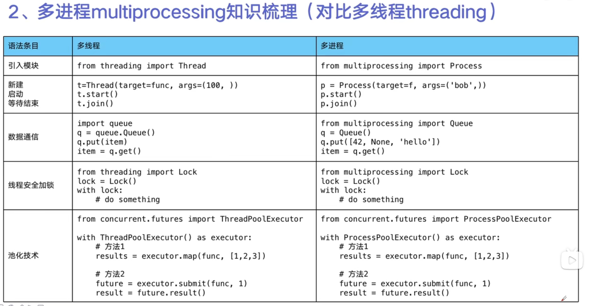

# Python 并发编程实战，用多线程、多进程、多协程加速程序运行

[视频链接](https://www.bilibili.com/video/BV1bK411A7tV?p=1)

# Python线程、进程、协程的区别

+ 一个进程中可以启动多个线程
+ 一个线程中可以启动多个协程
+ Python中多线程由于GIL的存在，无法利用多核，只能并发

多进程Process（multiprocessing）

+ 优点：
    + 可以利用多核CPU**并行计算**
+ 缺点：
    + 占用资源多，可以启动的数目比线程少
+ 适合：
    + CPU密集型计算

多线程Thread（threading）

+ 优点：
    + 相比进程，更轻量，占用资源少
+ 缺点：
    + 相比进程，**多线程只能并发执行**，不能利用多核CPU
    + 相比协程，启动数目有限制，内用资源，有切换开销
+ 适合： IO密集型计算，同时运行的任务数目要求不多

多协程Coroutine（asyncio）

+ 优点：
    + 内存开销最小，启动数目最多
+ 缺点：
    + 支持的库有限制（requests不支持，只能使用aiohttp），代码实现复杂
+ 适用：
    + IO密集型，需要超多任务运行，有现成库支持

Python在特殊场景下，可能比C++慢100~200倍。

```python
# queue.Queue是一个线程安全的通信队列
Queue.put()  # 添加元素
item = Queue.get()  # 获取元素
```

# 线程安全：Lock用于解决线程安全问题

```python
import threading

lock = threading.Lock
lock.acquire()
try:
    pass
finally:
    lock.release()
```

方式二：

```python
import threading

lock = threading.Lock
with lock:
    pass
```

# 线程池

新建线程需要分配资源，终止线程需要回收资源。

如果可以重用线程，则可以省去切换开销。

线程池适合突发性大量请求，但实际任务处理时间短的任务。

```python
# 方式1，使用map，map的结果和入参时顺序对应的
from concurrent.futures import ThreadPoolExecutor, as_completed

with ThreadPoolExecutor() as pool:
    results = pool.map(craw, urls)
    for result in results:
        print(result)

```

```python
# 方式2，使用future模式，注意用as_completed顺序是不定的
from concurrent.futures import ThreadPoolExecutor, as_completed

with ThreadPoolExecutor() as pool:
    futures = [
        pool.submit(craw, url) for url in urls
    ]
    for future in futures:
        # 按照url的顺序挨个获取结果
        print(future.result())
    for future in as_completed(futures):
        # 按完成的顺序获取结果
        print(future.result())

```

# flask_thread_pool

```shell
time curl http://127.0.0.1:5000/
# {"result_file": "file result", "result_db": "db result", "result_api": "api result"}
# real 0m1.356s
# user 0m0.000s sys
# 0m0.047s
```

# 多进程multiprocess（适合cpu密集）

python多线程不适合cpu密集型，

multiprocess是python为了你补GIL缺陷的模块，

原理是用多进程在多CPU上`并行执行`


# 协程

在单线程内实现并发（一个超级循环while True）

```python
import asyncio

# 获取时间循环
loop = asyncio.get_event_loop()


# 定义协程
async def mufunc(url):
    await get_url(url)


# 创建task列表
tasks = [loop.create_task(
    mufunc(url=url) for url in urls
)]
# 创建爬虫事件列表
loop.run_until_complete(asyncio.wait(tasks))
```

# 使用信号量（Semaphore）控制并发

Semaphore是一个同步对象，用于保持0至最大值之间的几个计数值

释放时+1，等待时-1

计数值>0，signaled状态，表示还有线程可以进入

，否则nosignaled

```python
import asyncio

sem = asyncio.Semaphore(10)
# ...later
async with sem:
    ...
# work with shared resource

```

或者

```python
sem = asyncio.Semaphore(10)
# ... later
await sem.acquire()
try:
    pass
    # work with shared resource
finally:
    sem.release()

```